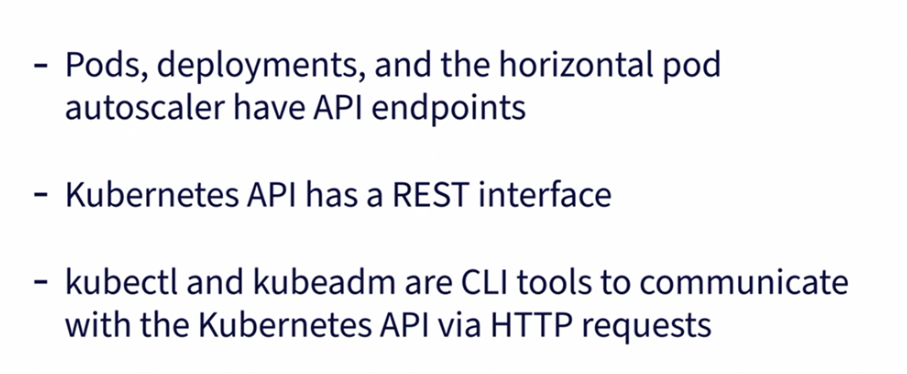
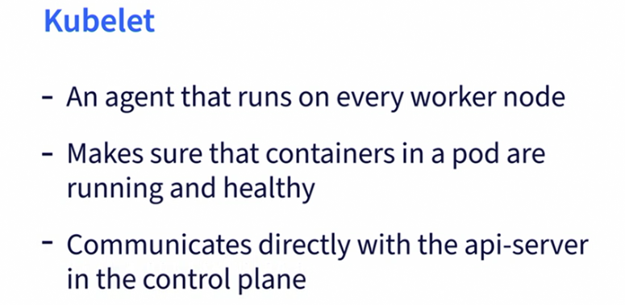
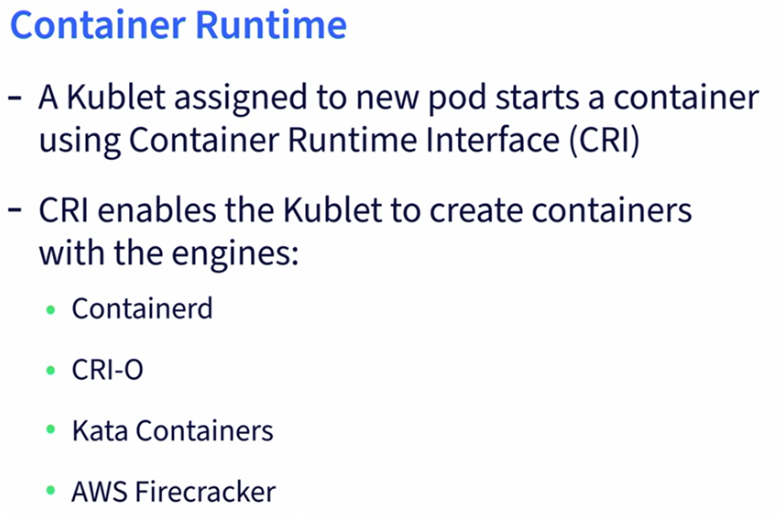
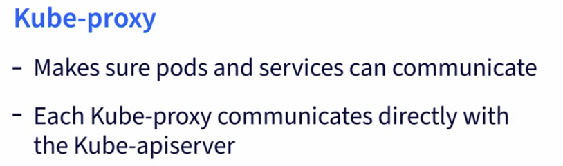
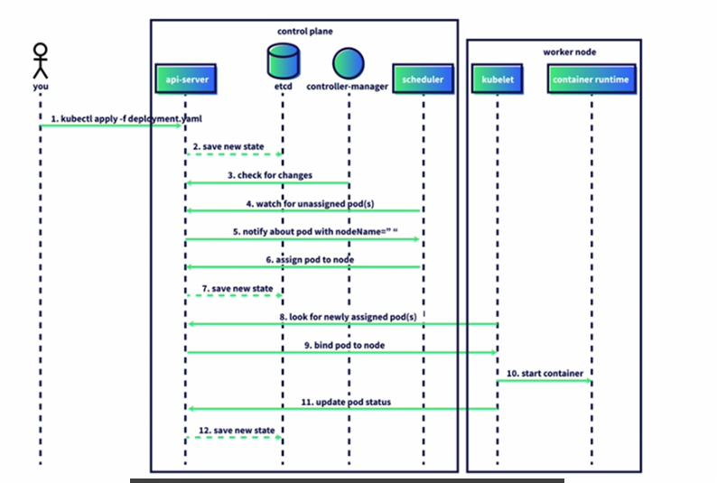

minikube start: Start Cluster<br>
minikube stop: stop Cluster<br>
minikube minikube update-check #Compare with latest version<br>
minikube delete #delete cluster<br>
kubectl cluster-info #info about where the cluster is running <br>
kubectl get nodes: Nodes from namespace<br>
kubectl get nodes -A: List nodes from all namespaces<br>
kubectl get namespacesor ns<br>
kubectl get services -A<br>
yamlchecker.com: validate yaml files<br>
kubectl apply -f namespace.yaml: create namespaces using yaml file<br>
kubectl delete -f namespace.yaml:delete namespaces using yaml file<br>
kubectl get pods -n development: get pods in development namespace<br>
kubectl delete  pod pod-info-deployment-68c8476764-dx98b  -n development<br>
kubectl describe  pod pod-info-deployment-68c8476764-dx98b  -n development: look at pod's event log<br>
kubectl get pods -n development -o wide: pods with IP addresses<br>
kubectl exec -it busybox-6c747767dd-gcwqf -- /bin/sh: connect to busybox pod interactively<br>
use busybox to interact with pods using their ip addresses for example #wget 10.244.0.6:3000<br>
kubectl logs pod-info-deployment-68c8476764-blpnd -n development: check if working.<br>
<h1> Create k8s Load Balance service</h1>

The service will send traffic to pods with pod-info app, to create the service first run 
bash
```
minikube tunnel
```

in another terminal deploy the service , you will go back to enter the PW in the tunnel window
<h3>resource management </h3>

* set CPU and Memory values
* https://kubernetes.io/docs/concepts/configuration/manage-resources-containers/ 


<h3>Clean up</h3>
You can delete resources

* using the yaml files
* by deleting the namespaces

<h3> K8s Architecture </h3>




```
kubectl api-resources #see all objects and their API versions
```

The Kubernetes control plan components 
* controler Manager
* Kube API server
* etcd 
* kube proxy 

The Kubernetes Worker Nodes 
* kubelet
* container runtime
* kube proxy 











<h3>Kubernetes Cluster Components  </h3>
A Comprehensive Glossary of Kubernetes Cluster Components<br>
Location in Cluster: Control Plane

* Cloud Controller Manager: Connects a Kubernetes cluster to a cloud provider's API, managing cloud-specific resources and ensuring proper integration with the underlying infrastructure
* etcd: A key-value store that saves all data about the state of the cluster; only the kube-apiserver can communicate directly with etcd
* kube-apiserver: The kube-apiserver is a key component of Kubernetes that exposes the Kubernetes API, handles most requests, and manages interactions with the cluster by processing and validating API requests, making it essential for the cluster's operation
* kube-controller-manager: Monitors the Kubernetes cluster's state, running processes to ensure the current state matches the desired state
* kube-scheduler: Identifies a newly created pod that has not been assigned a worker node and assigns it to a specific node

<h3> Location in Cluster: Worker Nodes </h3> 

* Container Runtime: Pulls container images, creates and manages containers, and ensures they run properly and securely as directed by the Kubernetes control plane
* kube-proxy: A network proxy that runs on each node in a Kubernetes cluster, maintaining network rules and enabling communication between pods and services within the node and the control plane, while also communicating directly with the kube-apiserver
* kubelet: An agent that runs on each node in a Kubernetes cluster, ensuring containers in a pod are running and healthy while communicating with the API server in the control plane to maintain the desired state of the node

Sucurity:
* Update your Kubernetes versions regulary
* scan your yaml manifest with a tool like synk
* add security context info to your deployments

Test your iac before deployment

```
synk iac test deployment.yaml
```